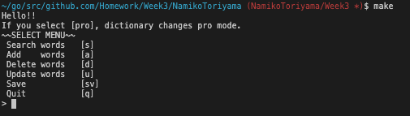
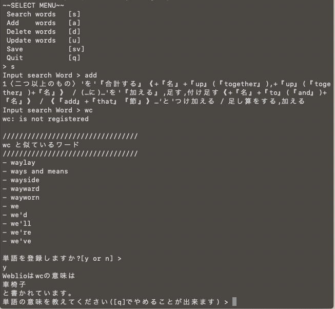
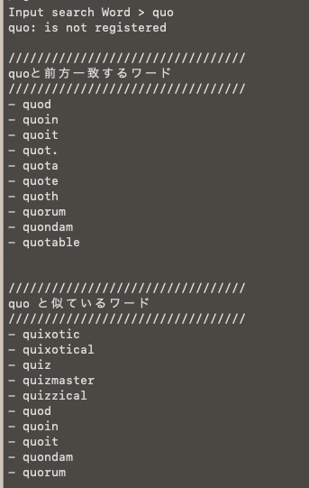
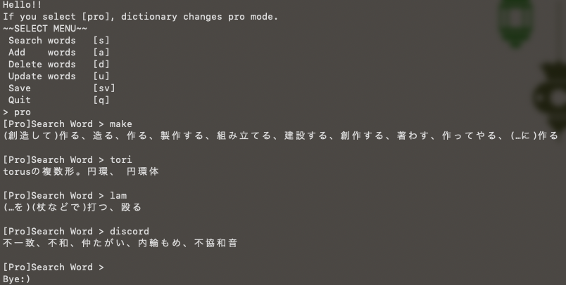
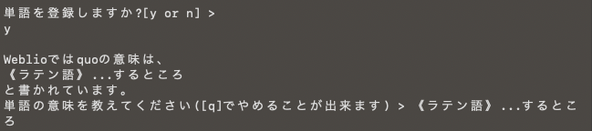
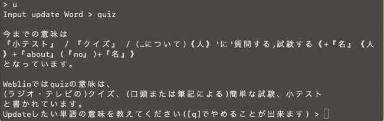

# CLIで実行できる英和辞書📖プログラムを作ろう！
Build@Mercariのプログラムで作成。

## 実行方法

```
$ make
$ make run
```

### PROモード使用時

スクレイピング用のパッケージ。一度だけやればOK

```
$ go get github.com/PuerkitoBio/goquery
```

## 実行画面


### SearchMode
<br>
前方一致するワードがないときは前方一致は表示されません。

<br>
前方一致するワードがあるときは表示されます。

### PROモード
<br>

## こだわりポイント
### PROモードの実装 [オリジナル機能]
普段使いできるような完全な辞書がほしいと思い、[weblio](https://ejje.weblio.jp/)から意味をスクレイピングして調べられるようにしました。<br>
SELECT MENUの画面で`pro`というコマンドを打つと利用することができます。`goquery`というパッケージを利用して実装しました。

### 意味を登録するときの推薦機能 [オリジナル機能]
PROの実装時に作成した関数を利用して、単語の意味を登録する際にweblioで書かれている意味を表示するようにしました。
- search時に検索したワードがなかった場合


<br>

- 単語をaddする場合


<br>

- 意味をupdateする場合



に利用しています。


### 似た単語のサジェスト [Hard]
trie木を利用し、前方一致の単語を表示させるようにしました。<br>
また、HashTableを利用して、似たようなワードをサジェストする機能も作りました。<br>

ハミング距離やレーベンシュタイン距離を求めることによって、より似たようなワードがもしかしたら出せるのではないかと思いましたが、実行時間が長そうなのと課題が終わらない関係で諦めました。

### 追加・更新・削除機能 [Normal]
こちらは普通の機能です。追加更新削除を利用した場合は、`save`コマンドを打たないとsaveされないようになっています。

### ファイル構成
なるべく関数が大きくなりすぎないように、関数を小分けにして書きました。<br>
ファイル構成もなるべくスッキリするように心がけました。

## 考えたこと・やったこと
### テキストファイルの読み込み時間の比較
- ファイルサイズが大きいので少し不安になり比較してみました([参考](https://qiita.com/qt-luigi/items/2c13ad68e7d9f8f8c0f2))

|  手法  |  実行時間(sec)  |
| ---- | ---- |
|  バイト文字列  |  1.094172  |
|  bufioパッケージ(改行コード単位)  |  0.685134  |
|  bufioパッケージ(行単位・区切り文字指定)  |  0.073672  |
|  ioutilパッケージ(一括)  |  0.008514  |

そこまで大きく変わらなそうなので上から3つめのものでテキストを読み込むことにしました。

### サジェスト機能
**1. 配列を使ったサジェスト機能**<br>
まずはじめに、ハッシュテーブルで実装したので、ハッシュテーブルをうまく使えるサジェスト機能を考えました。<br>
実際の実装については、

- ハッシュテーブルでデータを作る際に、単語だけの配列を作成する
  - textファイルは辞書順で並んでいるので、appendのみ行う
- あるkeywordが与えられた時に二分探索を行い、keywordに近い配列の番号を返す
- 返した番号の前後5個ずつを調べてappendする。最大で10単語表示される
  - この際、先頭のアルファベットが違うものは明らかに遠いので排除することにする
  - keywordの番号が先頭と最後に近い場合はサジェストの個数が少なくなる

という感じで行いました。

insert関数を作り忘れたので、プログラム実行中にaddしたワードについてはサジェストされないという問題点もあります。

**2. Trie木を使った前方一致検索**<br>
次に、slackでtrie木を使っている方が多かったので、LinkedListを参考に真似して作ってみました。

私は下記のようなノードを作成したのですが、

```
type Node struct {
	value  string     //  対象のアルファベット１文字を入れる
	isWord bool       //  辿って来たノードが単語をなしているかどうか
	word   string     //  辿ったノードを戻って単語を生成するのが面倒だったため、追加
	next   []*Node    //  次に繋がっている単語のノード
}
```
`golang trie`で検索したところ、`children map[rune]*Node`を使うのが一般的なようです。

実際の実装については、

- ハッシュテーブルでデータを作る際に作成した各単語の配列をTrie木に作り直す
- 各単語を1文字ずつに分解し、nextの*Node配列に対し検索を行い、以下のように場合分けを行う
  - その１文字がすでにノードに存在しているならば、そのノードへポインタを移動
  - 存在していないならば、新しいノードとしてTrie木に追加する
- ある単語についてinsertし終えたら、isWordをtrueにする

検索については、

- 入力した単語を１文字ずつに分解する
- Trie木のポインタを１文字ずつ進めていく
  - この時点でない場合はNullを返す
- 最後までポインタが進んだ場合は、nextの*Node配列を幅優先探索で探索する
  - 単語については、1, 2文字の単語などを入れると大量に表示されてしまうため、10単語になった時に探索を終えるようにした
  - 上記の関係で入力された単語に比較的近いワードが表示されるような幅優先探索を適用した

というような感じで行いました。

### その他の細かなこと
`decentralization,decentralisation`や`womanize, womanise`のものを一意のkeyになるように修正<br>

``` 
# e.g
decentralization,decentralisation
decentralize,decentralise
```

ももかさんがslackで言及していた、同一キーワードの修正(ありがとうございます)<br>

```
# e.g
con	…'を'よく研究する
con	反対して / 反対投票,反対論
con	〈人〉'を'ペテンにかける
con	=convict
con	=confidence trick
```

## コメント
デザインセンスが皆無なので、機能的な辞書を作ろうと頑張りました。<br>
Trie木の実装が難しかったのですが、できたときはとても嬉しかったです。
